# ucvelocity-demo-france

* [Steps to create a simple Azure DevOps pipeline](#steps-to-create-a-simple-azure-devOps-pipeline)
* [How to create an Azure access token](#how-to-create-an-azure-access-token)
* [Steps to configure resources in UrbanCode deploy](#toto)
* [Steps to create the VSM Json file on the VM](#toto)

## Steps to create a simple Azure DevOps pipeline

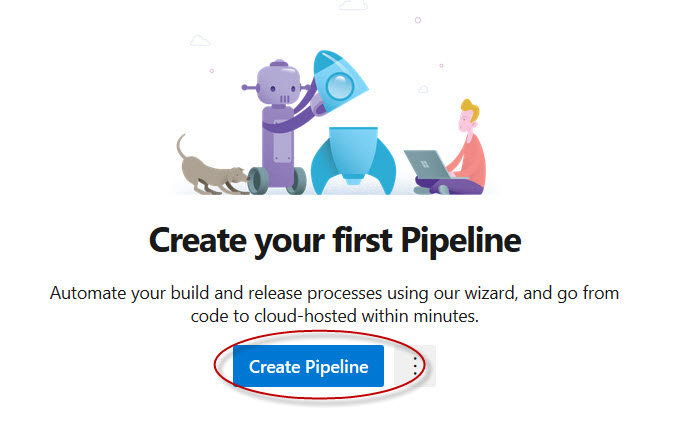

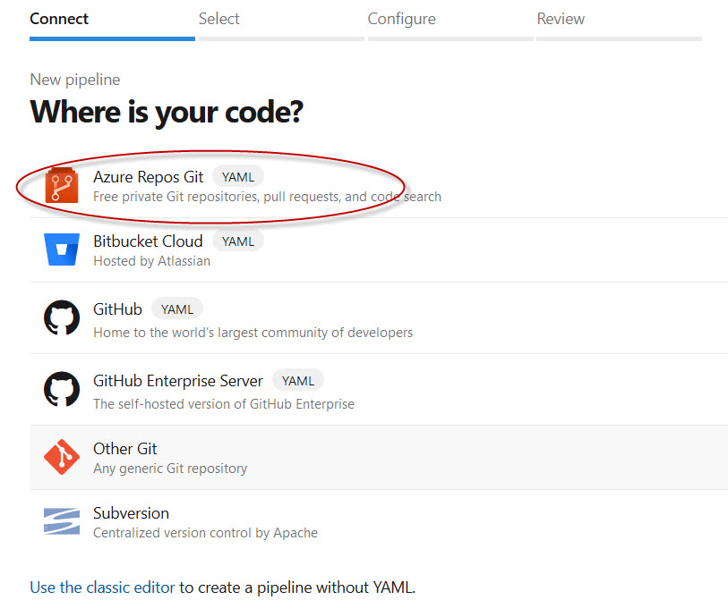

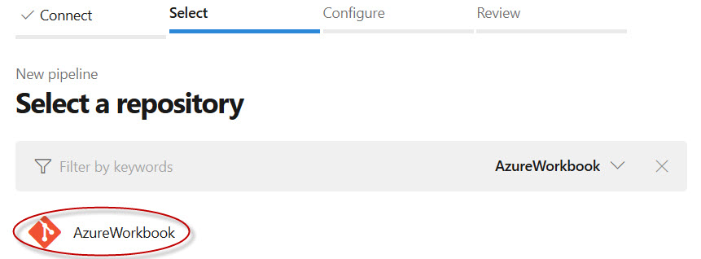

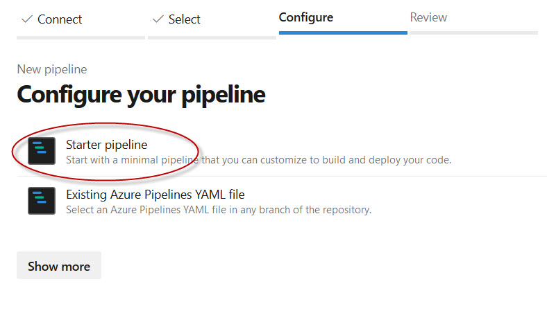

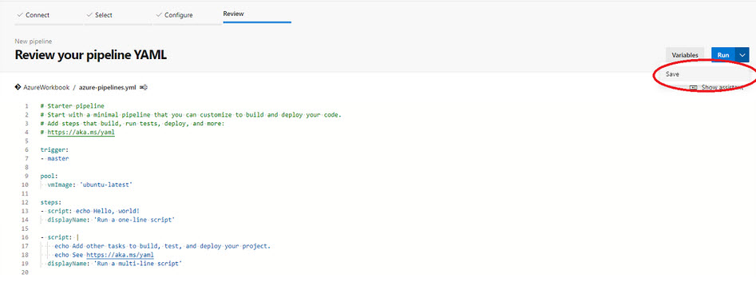

## How to create an Azure access token
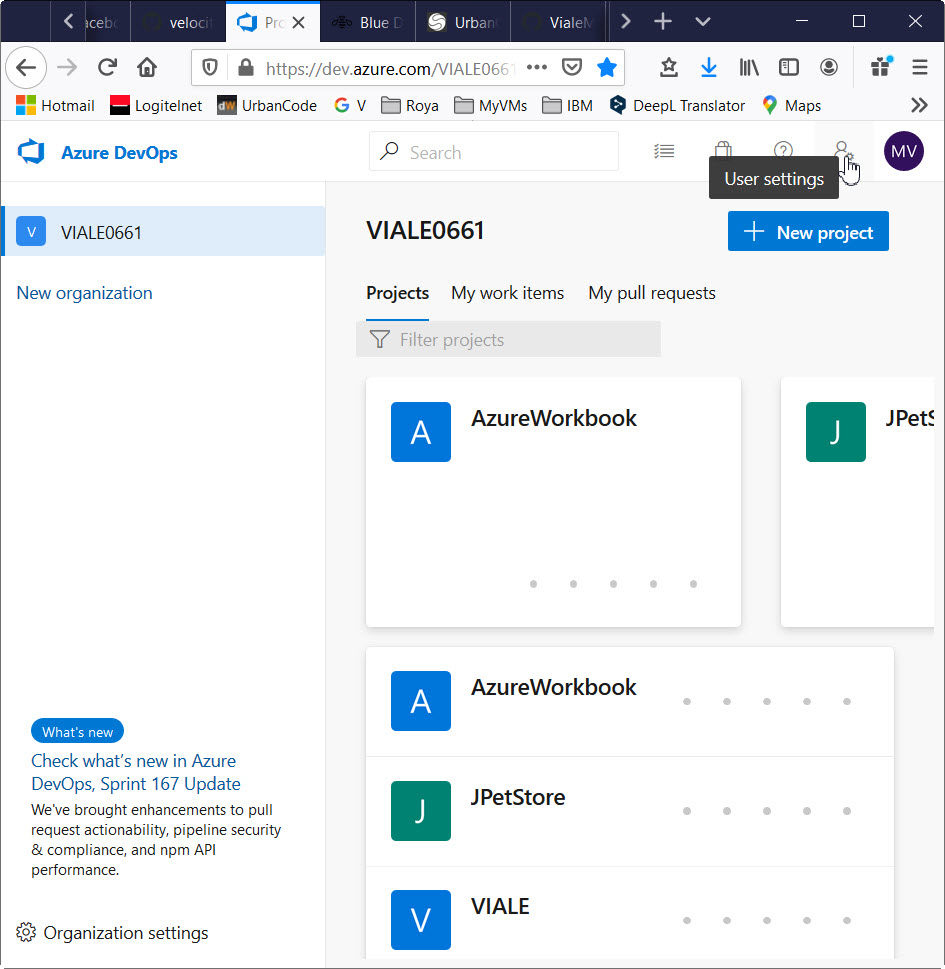

## Steps to configure resources in UrbanCode deploy

In UCD, navigate to home -> Ressources.
Click on **create Top-Level Group** and call it **urbancode.com**

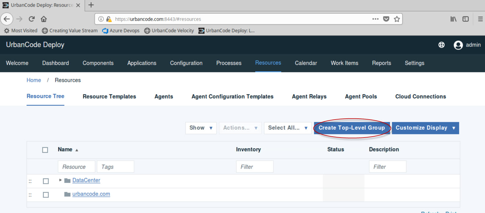

Define a common deployment target for all environments:
*	Click the Actions drop-down menu to the right of **UrbanCode.com**. Click Add Agent then choose **datacenter** (our local agent).
* Click the Actions drop-down menu to the right of **datacenter**. Click Add component and choose the component **WorkBookComp**.

Assign that resource to each environment of the application.
* In UCD, navigate to the environment of the WorkBook application: **Home > Applications > WorkBook > Environments > DEV**.
* From the Resources tab, click the Add Base Resources button. Select the **WorkBookComp** resource and click OK

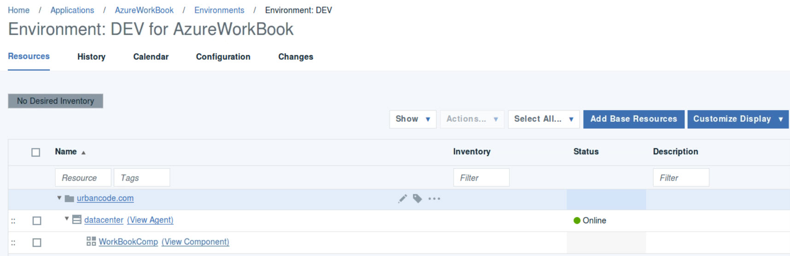

Repeat that last step for all the other environments.

## Steps to create the VSM Json file on the VM

Open gedit editor in Applications -> Accessories -> gedit

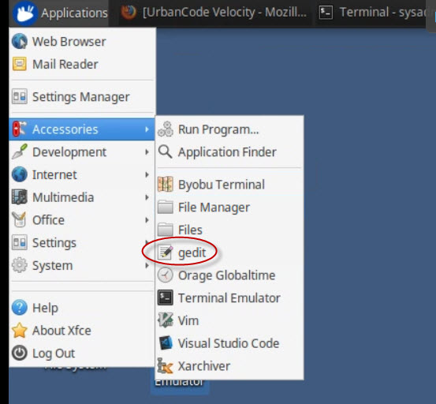

Go to the web page containing the source code, and select the content of the json file:
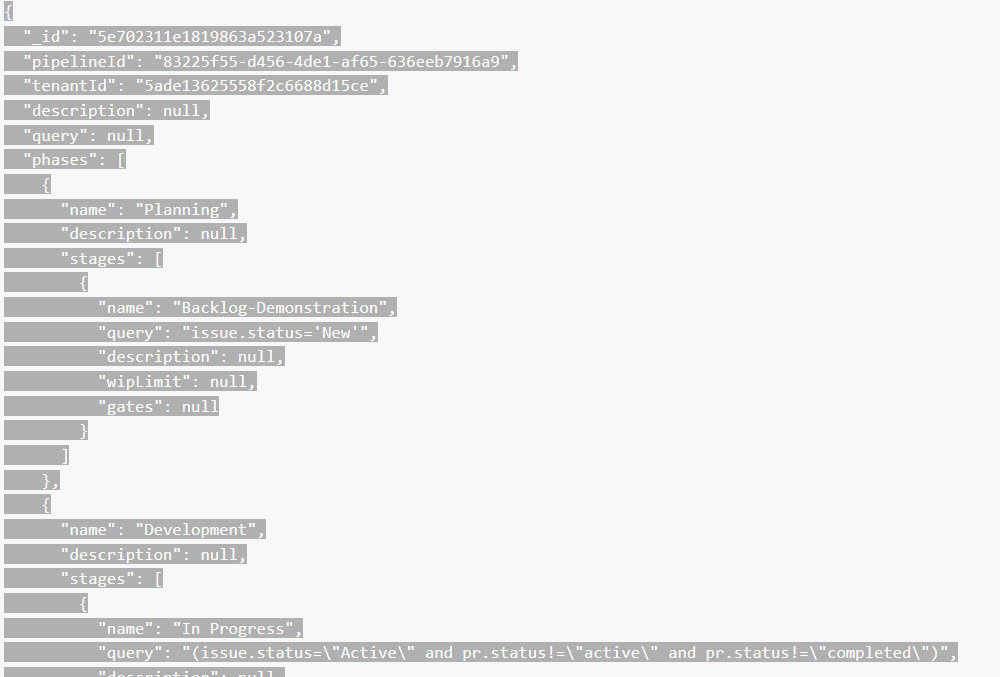

Go back to the VM and paste the content into the clipboard of the emulator:

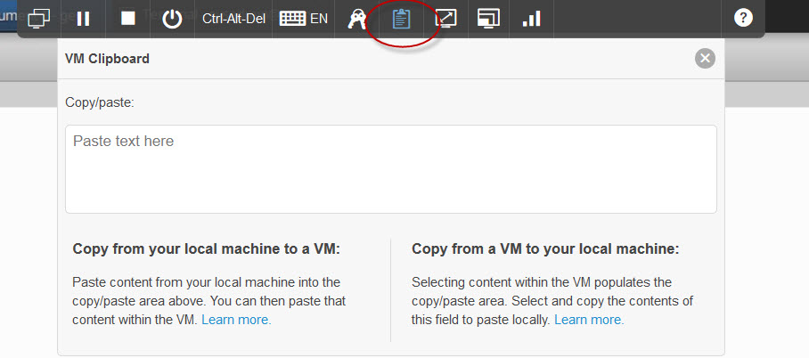

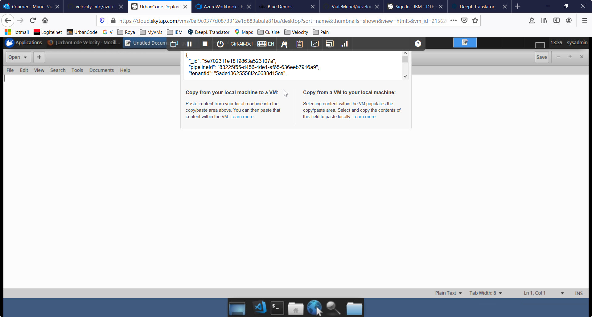

The text can now be pasted into the editor. It is just an other Ctrl+v, but in the editor window this time.

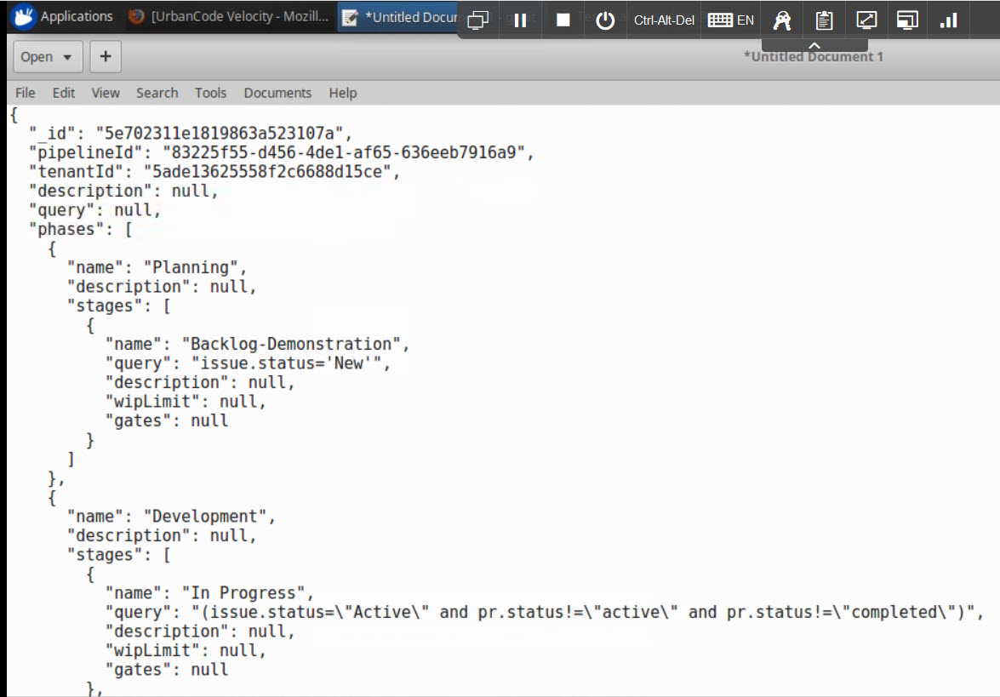

Save the document as AzureWorkbook.json, in the sysadmin Documents folder :

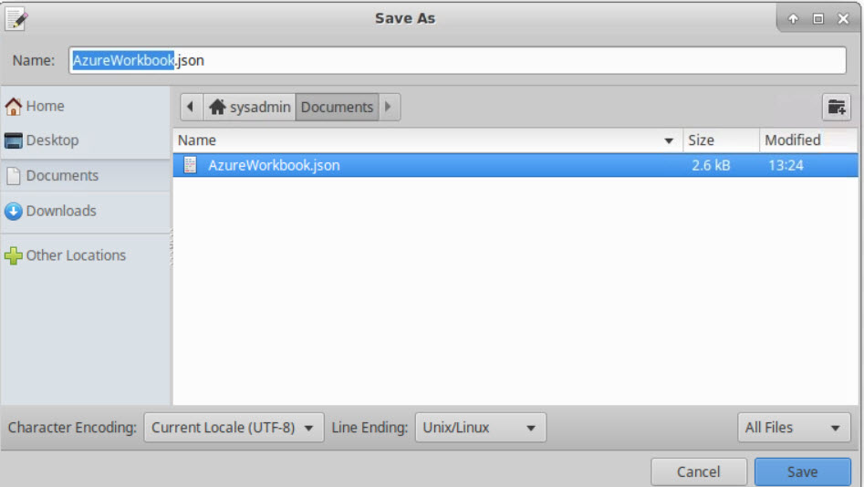

The Json file can now be uploaded in the Velocity VSM, using the upload button.
